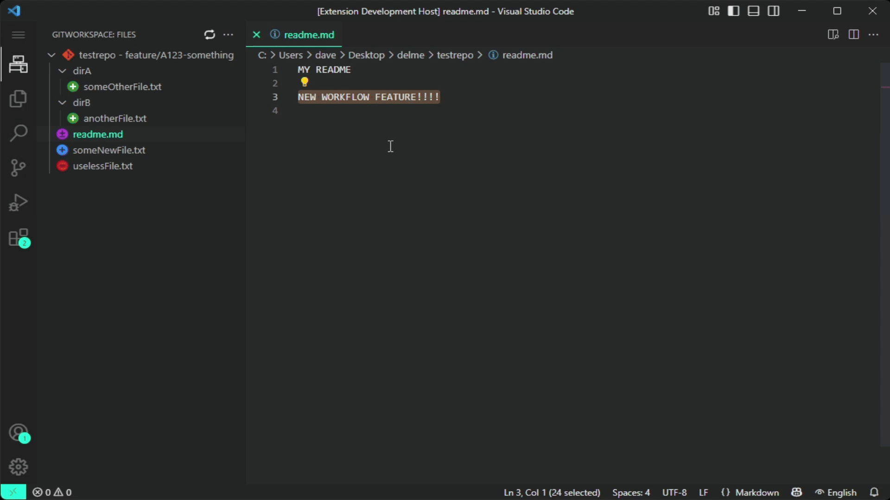

# Git Workspace

A convenient Git-based file explorer that displays (1) currently changed files, and (2) ALL files ever modified by
the current branch (since its creation!) for one or more Git repositories.

## Features

- 📁 **File Explorer Panel**  
  Displays all changed files (both tracked and untracked) from the specified Git repositories.

- 🔀 **Branch Diff View**  
  Additionally, shows ALL changes of the current branch compared to its origin (the fork-off point from the `master` or
  `main` branch)!
  This provides a clear view of every file the branch has ever changed, **ignoring intermediate merges**!
  Ideal for visualizing the full impact of a feature/topic branch.

- ⚙️ **Custom Workflows**   
  A custom workflow is a set of commands that are executed in succession within the selected repository.
  Custom Workflows can be executed in a specific repository by clicking on it in the extension's explorer.
  See the demo shown in the gif above.
  They can be easily defined in the settings!

- 🔍 **Git Status Indicators**  
  Icons next to each file indicate its current Git status (e.g., modified, added, deleted).

- 🧬 **Multi-Repository Support**  
  Works seamlessly with multiple Git repositories within the same workspace.

- 🔄 **Live Updates**  
  Automatically refreshes when files change in one of the repositories or via a manual refresh button.

## QuickStart

Just add the (absolute) path to one or multiple Git repositories in the extensions settings!

## Icons-Legend

| Icon                                              | Meaning              |
|---------------------------------------------------|----------------------|
|               | Added                |
|             | Deleted              |
|            | Modified             |
|           | Untracked            |
|                                                   |                      |
|     | Committed + Added    |
|  | Committed + Modified |
|   | Committed + Deleted  |

The three icons on the bottom (Committed + XXXXX) represent files that have been committed to the current branch,
regardless of whether these changes have already been merged back into the default branch (master/main).

## Support

**If you like this extension you can buy me a coffee :)**

**Suggestions, feature requests or contributions are welcome on [Github](https://github.com/DaveWasTakn/GitWorkspace).**

**You can also leave reviews on
the [Microsoft Visual Studio Marketplace](https://marketplace.visualstudio.com/items?itemName=daveWasTaken.gitworkspace).**

## Repository

https://github.com/DaveWasTakn/GitWorkspace

## License

This extension is an open source project released under the [MIT](LICENSE.txt) license.
